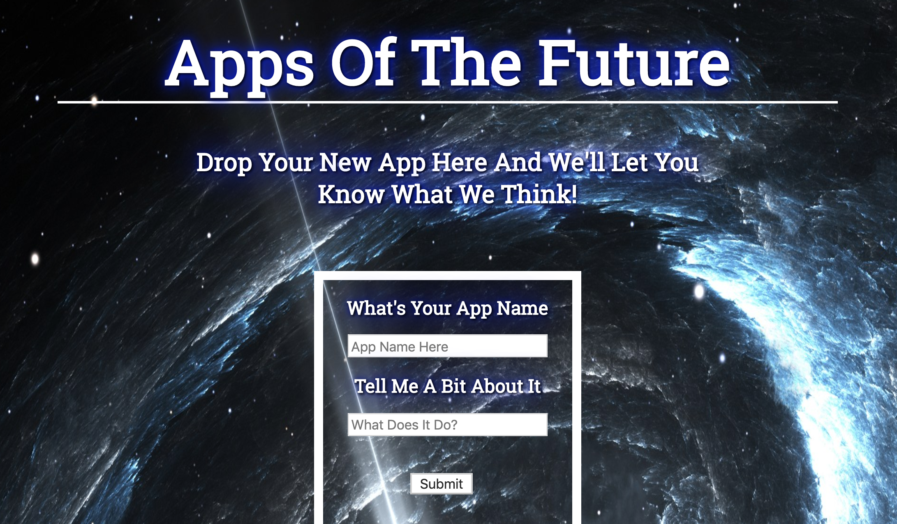
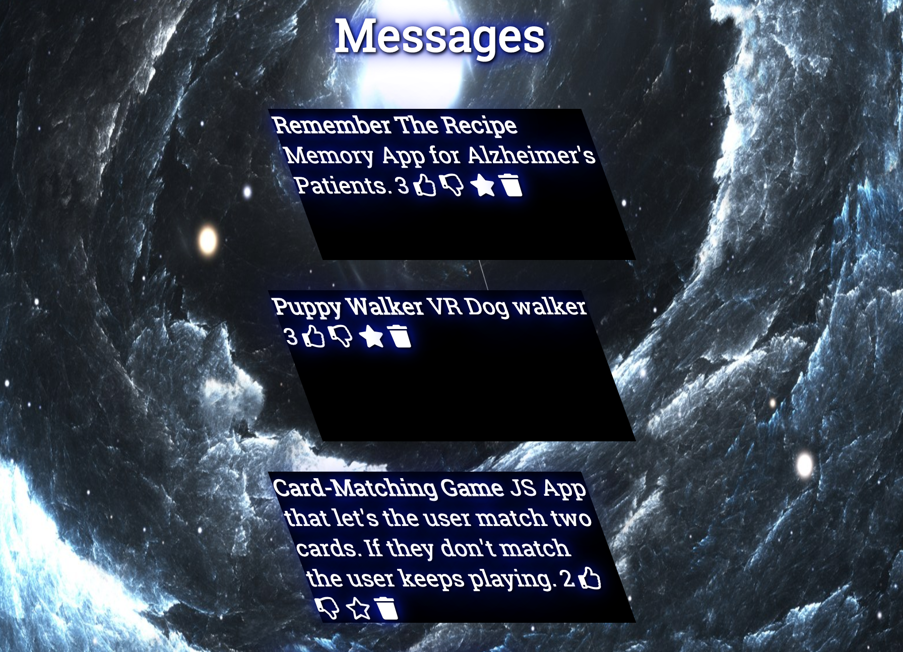

# Apps Of The Future
Apps of the Future is a place for startups to put themselves out there! State the name of your Application and if others like it, they'll favorite. They can also give you a thumbs up and move you straight to the top. If not, you'll find yourself at the end of the list with enough thumbs down. Good Luck!

## How It's Made:

**Tech used:** ejs, CSS, JavaScript, NodeJS and stored on MongoDB

This personal project is a full stack web application. I utilized node.JS and stored on mongoDB. Users can input their application name. Others can then like or dislike the product. If majority left a thumbs up, the application makes it's way to the top of the list. If there are more thumbs down than thumbs up, the application ends up last on the list. you can also favorite the app where the colored star toggles between the see through star. 

## Installation

1. Clone repo
2. run `npm install`

## Usage

1. run `node server.js`
2. Navigate to `localhost:3000`
